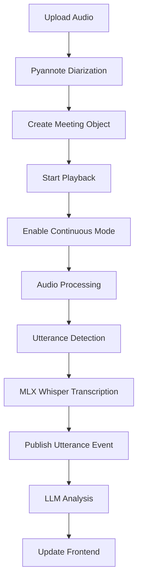

# Meeting Simulation & Real-time Conversation Analysis
## Implementation Plan

### 🎯 **Project Overview**

Transform Osmo Assistant into a real-time conversation analysis system by first removing wake word dependency and implementing continuous processing, then adding meeting simulation for rapid testing and development.

**Goal**: Create a system that can:
- Process audio continuously without wake words
- Upload meeting audio files
- Perform speaker diarization using pyannote.audio
- Simulate real-time meeting playback
- Generate live transcripts with speaker identification
- Provide AI-powered conversation analysis and suggestions
- Display concepts, topics, and insights as they emerge

---

## **Phase 1: Audio Pipeline Transformation** 🔧 (PRIORITY)

### **1.1 Remove Wake Word Dependency**
- [ ] Open `backend/core/audio.py`
- [ ] Remove/comment out all wake word detection logic
- [ ] Remove `_contains_wake_word()` method
- [ ] Remove wake word list (`self.wake_words`) and related variables
- [ ] Update `_handle_transcript()` to skip wake word checks
- [ ] Remove context accumulation mode dependencies

### **1.2 Implement Continuous Processing Mode**
- [ ] Add `continuous_mode` flag to `AudioProcessor.__init__()`
- [ ] Create `enable_continuous_mode()` method
- [ ] Modify `_process_vad_frame()` to process all speech when in continuous mode
- [ ] Update silence detection to use 500ms threshold for utterance boundaries
- [ ] Create new event action `utterance_ready` in `backend/events.py`

**Implementation in `audio.py`**:
```python
# Add to __init__
self.continuous_mode = False
self.utterance_silence_threshold = 15  # ~500ms at 30ms frames

# New method
async def enable_continuous_mode(self):
    """Switch to continuous processing for meeting playback"""
    self.continuous_mode = True
    self.context_mode = False  # Disable wake word context mode
    logger.info("Continuous processing mode enabled")

# Modify _process_vad_frame
async def _process_vad_frame(self, audio_frame: np.ndarray):
    # ... existing VAD logic ...
    
    if self.continuous_mode:
        # Process utterance when silence detected
        if self.vad_state == "SPEAKING" and self.silence_frame_count >= self.utterance_silence_threshold:
            logger.debug("Utterance boundary detected in continuous mode")
            await self._process_speech_segment()
    else:
        # Original wake word logic (keep for compatibility)
        # ... existing wake word processing ...
```

### **1.3 Update Event System**
- [ ] Add `utterance_ready` to event actions in `backend/events.py`
- [ ] Update `backend/core/tasks.py` to handle utterance events
- [ ] Ensure continuous mode events flow through existing LLM pipeline
- [ ] Test event flow: utterance → transcript → LLM analysis

### **1.4 Test Continuous Mode**
- [ ] Create test script to verify continuous processing
- [ ] Test with live microphone input
- [ ] Verify utterance detection at 500ms silence
- [ ] Ensure smooth transition between utterances

---

## **Phase 2: Backend Integration** 🔧

### **2.1 Dependency Container Integration**
- [x] Created `MeetingSimulator` class in `backend/core/meeting_simulator.py`
- [ ] Add `MeetingSimulator` to `backend/core/shared.py`
- [ ] Wire into dependency injection system
- [ ] Configure pyannote.audio with Hugging Face authentication
- [ ] **Add continuous mode activation in meeting simulator**

### **2.2 Pyannote Integration Specifics**
**Model**: [pyannote/speaker-diarization-3.1](https://huggingface.co/pyannote/speaker-diarization-3.1)

**Requirements**:
- Hugging Face access token (`HUGGINGFACE_TOKEN`)
- Accept user conditions for the model
- Audio automatically resampled to 16kHz mono
- Optional GPU acceleration with CUDA

**Implementation**:
```python
from pyannote.audio import Pipeline
pipeline = Pipeline.from_pretrained(
    "pyannote/speaker-diarization-3.1",
    use_auth_token=os.getenv("HUGGINGFACE_TOKEN")
)

# GPU acceleration if available
if torch.cuda.is_available():
    pipeline.to(torch.device("cuda"))
```

### **2.3 Meeting Simulator Updates**
Update `backend/core/meeting_simulator.py`:
```python
async def start_meeting_playback(self, speed: float = 1.0):
    """Start real-time playback simulation"""
    if not self.current_meeting:
        return {"success": False, "error": "No meeting loaded"}
    
    # Enable continuous mode in audio processor
    await self.audio_processor.enable_continuous_mode()
    
    self.is_playing = True
    self.playback_speed = speed
    # Rest of existing implementation...
```

### **2.4 API Endpoints Creation**
- [ ] `POST /meeting/upload` - Upload audio file with multipart form data
- [ ] `POST /meeting/playback/start` - Start real-time meeting simulation  
- [ ] `POST /meeting/playback/stop` - Stop playback
- [ ] `GET /meeting/status` - Get current meeting and playback status
- [ ] `POST /meeting/playback/speed` - Adjust playback speed (0.5x to 3x)

### **2.5 Event System Enhancement**
- [ ] Add `MEETING_EVENT` to `backend/events.py`
- [ ] New event actions:
  - `meeting_uploaded` - File processed and ready
  - `meeting_transcript_segment` - Real-time transcript segment
  - `meeting_analysis_update` - AI analysis insights
  - `meeting_playback_started/stopped/finished`
  - `utterance_ready` - Continuous mode utterance complete

### **2.6 Dependencies**
```bash
# Already added to requirements.txt:
librosa
pydub
pyannote.audio
datasets
transformers
```

---

## **Phase 3: Frontend Development** 🎨

### **3.1 Meeting Dashboard Creation**
- [ ] **New Route**: `/meeting` - Dedicated meeting testing interface
- [ ] **Layout**: 4-panel dashboard design:
  ```
  [Upload Panel]     [Playback Controls]
  [Live Transcript]  [AI Analysis]
  ```

### **3.2 Core Components**

#### **`MeetingUpload.tsx`**
- [ ] Drag-drop file upload (supports .wav, .mp3, .m4a)
- [ ] Upload progress and processing status
- [ ] Speaker count and duration display after processing
- [ ] File validation and error handling

#### **`MeetingPlayback.tsx`**
- [ ] Play/Pause/Stop controls
- [ ] Speed adjustment (0.5x, 1x, 2x, 3x)
- [ ] Progress bar with time indicators
- [ ] Current position display
- [ ] Meeting info display

#### **`MeetingTranscript.tsx`**
- [ ] Real-time transcript stream
- [ ] Speaker-color-coded segments
- [ ] Timestamp display
- [ ] Auto-scroll with manual override
- [ ] Speaker identification labels

#### **`ConversationAnalysis.tsx`**
- [ ] **Current Topics**: Dynamic topic bubbles/tags
- [ ] **Key Entities**: People, companies, concepts mentioned
- [ ] **Sentiment**: Overall mood indicator
- [ ] **Progress Timeline**: Topic evolution over time

#### **`AISuggestions.tsx`**
- [ ] **Live Suggestions**: Context-aware meeting insights
- [ ] **Action Items**: Automatically detected tasks
- [ ] **Follow-up Questions**: AI-generated conversation starters
- [ ] **Research Triggers**: Topics that warrant web search

### **3.3 WebSocket Event Handling**
- [ ] Update `frontend/src/lib/useSocket.ts` for meeting events
- [ ] Handle `utterance_ready` events from continuous mode
- [ ] Real-time transcript updates
- [ ] Analysis data streaming
- [ ] Playback status synchronization

---

## **Phase 4: Configuration & Setup** 🤖

### **4.1 Environment Variables**
```bash
# Required additions to .env
HUGGINGFACE_TOKEN=your_hf_token_here  # For pyannote model access
OPENROUTER_API_KEY=your_key_here      # For AI analysis (already exists)
```

### **4.2 Model Performance Optimization**
- [ ] **CPU vs GPU**: Auto-detect CUDA availability
- [ ] **Memory Management**: Process audio in chunks for large files
- [ ] **Caching**: Store diarization results to avoid reprocessing
- [ ] **Error Handling**: Graceful fallback to mock diarization

### **4.3 Enhanced Mock Fallback**
- [x] Intelligent mock diarization when pyannote unavailable
- [x] Realistic speaker patterns based on audio duration
- [ ] Sample conversation content for testing

---

## **Phase 5: Integration & Testing** ⚡

### **5.1 Test Continuous Mode**
1. Test audio processor without wake words
2. Verify utterance detection at 500ms silence
3. Ensure smooth transition between utterances
4. Test with live microphone input first

### **5.2 Data Flow Pipeline**

**Upload & Processing**:
```
User Upload → File Validation → Audio Loading → 
Enable Continuous Mode → Pyannote Diarization → 
Segment Creation → Ready for Playback
```

**Real-time Simulation**:
```
Start Playback → Enable Continuous Mode → Process Segment → 
Detect Utterance Boundary → Transcribe with MLX Whisper →
Publish Utterance Event → Analyze with LLM → Update UI
```

### **5.3 Testing Workflow**
1. **Test Continuous Mode** with live microphone
2. **Upload** meeting file via drag-drop interface
3. **Diarization** using pyannote (displays speaker timeline)
4. **Preview** meeting info and detected speakers
5. **Playback** with real-time transcript and analysis
6. **AI Insights** appearing contextually during conversation

### **5.4 Performance Metrics**
- Utterance detection accuracy: >95%
- Upload processing time (target: <30s for 5min audio)
- Diarization accuracy (pyannote benchmarks: 7-25% DER)
- Real-time simulation latency (target: <2s transcript delay)
- AI analysis response time (target: <5s for insights)

---

## **Implementation Timeline**

### **Step 1: Audio Pipeline Changes** (30 minutes) **[PRIORITY]**
```python
# 1. Open backend/core/audio.py
# 2. Remove wake word detection code
# 3. Add continuous_mode flag and methods
# 4. Update VAD processing for continuous mode
# 5. Test with live audio input
```

### **Step 2: Backend Integration** (20 minutes)
```python
# 1. Update backend/core/shared.py with MeetingSimulator
# 2. Add continuous mode activation in meeting simulator
# 3. Add meeting API endpoints to app.py
# 4. Update events.py with utterance_ready and MEETING_EVENT
# 5. Configure Hugging Face authentication
```

### **Step 3: File Upload API** (10 minutes)
```python
# 1. Add multipart file upload endpoint
# 2. File validation (audio formats, size limits)
# 3. Temporary file handling and cleanup
# 4. Progress tracking for large files
```

### **Step 4: Frontend Dashboard** (35 minutes)
```typescript
// 1. Create /meeting route and layout
// 2. Build file upload with progress
// 3. Create playback controls
// 4. Build real-time transcript display
// 5. Create analysis panels (topics, suggestions)
// 6. Wire WebSocket events for real-time updates
```

### **Step 5: Testing & Refinement** (15 minutes)
```bash
# 1. Test continuous mode with live audio
# 2. Test with user's meeting file
# 3. Verify pyannote diarization accuracy
# 4. Test real-time playback simulation  
# 5. Check AI analysis quality
# 6. Polish UI responsiveness
```

**Total Estimated Time: ~110 minutes**

---

## **Technical Architecture**

### **Event Flow**


### **Data Models**
```python
@dataclass
class SpeakerSegment:
    speaker_id: str
    start_time: float
    end_time: float
    text: str
    concepts: List[str] = None
    
@dataclass 
class MeetingAnalysis:
    current_topics: List[str]
    key_entities: List[str]
    sentiment: str
    suggestions: List[str]
    action_items: List[str]
```

### **API Endpoints**
```
POST /meeting/upload
├── file: UploadFile
└── name?: string

GET /meeting/status
└── returns: MeetingStatus

POST /meeting/playback/start
├── speed?: float (0.5-3.0)
└── returns: PlaybackStatus

POST /meeting/playback/stop
└── returns: PlaybackStatus
```

---

## **Critical Changes from Original Plan**

1. **Wake Word Removal**: Must be completed before meeting simulation
2. **Continuous Mode**: Audio processor needs new mode for processing all speech
3. **Utterance Detection**: 500ms silence threshold for natural speech boundaries
4. **Event Flow**: `utterance_ready` events replace wake word triggered events
5. **Testing Priority**: Live audio testing before meeting simulation

---

## **Expected Outcomes**

✅ **Continuous Processing**: Remove wake word bottleneck for natural conversation flow  
✅ **Professional Diarization**: Accurate speaker separation using state-of-the-art pyannote model  
✅ **Real-time Simulation**: Meeting plays back with live transcript and analysis  
✅ **AI Insights**: Contextual suggestions and topic tracking as conversation progresses  
✅ **Visual Diarization**: Speaker timeline and segment visualization  
✅ **Fast Testing**: Quick upload → process → test cycle for iteration  

**The system will demonstrate exactly what real-time conversation analysis would look like in a live meeting scenario.**

---

## **Next Steps**

1. **PRIORITY**: Remove wake word dependency and implement continuous mode
2. Test continuous processing with live microphone
3. Set up Hugging Face token and model access
4. Begin meeting simulation integration
5. Test with uploaded meeting file
6. Iterate on UI and analysis quality

## **Notes**

- **Phase 1 is critical**: All subsequent features depend on continuous processing
- Pyannote model requires user agreement and HF token
- GPU acceleration recommended for faster processing
- Mock fallback ensures testing even without model access
- Modular design allows easy extension to live audio streams
- Continuous mode enables natural conversation flow without artificial triggers 